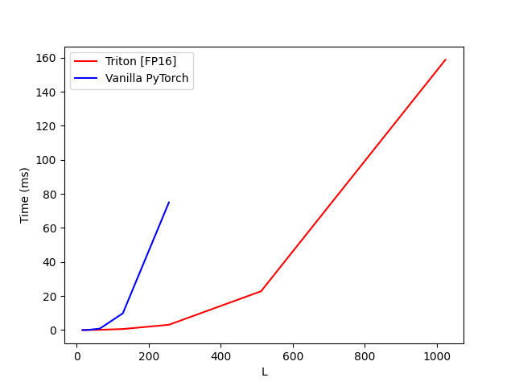

# Triton Implementation of Triangular Attention

This repository contains an efficient implementation of 
triangular attention using Triton, specifically designed for 
protein structure prediction models like AlphaFold2. 

The implementation is based on the Flash Attention 2.0
algorithm but modified to handle the unique requirements 
of triangular attention: 5d tensors operating over pairwise
representations (B, H, L, L, D), and a bias term over
the attention weights, through which we wish to
propagate gradients.

NOTE: As of 2025-02-24, only the forward pass is implemented.

### Input Format
- Query (Q): `(Batch, Heads, L1, L2, Dims)`
- Key (K): `(Batch, Heads, L1, L2, Dims)`
- Value (V): `(Batch, Heads, L1, L2, Dims)`
- Bias (B): `(Batch, Heads, L1, L2)`

### Key Differences from Standard Attention

1. **Additional Bias Term**: Unlike standard attention
    which only uses QK^T similarity, this implementation
    includes an additional bias term that modulates the
    attention scores. 
2. **5D Tensors**: Works with 5D tensors (B, H, L1, L2, D)
    instead of the standard 4D tensors used in 
    transformer attention

## Performance Results

Benchmarked on an NVIDIA L4 GPU with the following parameters:
- Batch Size: 4
- Heads: 8
- Head Dimension: 32

### Memory Usage

### Latency

## Usage

See [example_usage.py](example_usage.py) for a simple example of how to use the implementation.

## Acknowledgments

This implementation is an adaptation of the Triton 
tutorial implementation of Flash Attention 2.0, which can be 
found [here](https://triton-lang.org/main/getting-started/tutorials/06-fused-attention.html). The attention 
mechanism is based on the [AlphaFold2 paper](https://www.nature.com/articles/s41586-021-03819-2). This repository 
is intended to be an open source reproduction of the flash
triangular attention mechanism described in the [NeuralPLexer 3 paper](https://arxiv.org/abs/2412.10743)
